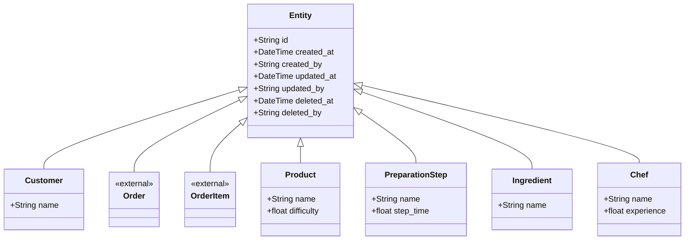

# Entities



## Entity

Shared base for every **entity** in the domain: identity plus audit trail

### Design notes

- `id` defaults to a `uuid4` when not supplied, so entities are identifiable
  before they ever reach a service or store.

## Ingredient

A raw material consumed while preparing a product. An ingredient knows *what it
is

## Product

What the customer buys — the menu item. A product knows how hard it is to make
and which steps produce it; it does not know anything about stock.

### Design notes

`difficulty` exists to feed the preparation-time formula of requirement 10:

```
step_duration = step.step_time / chef.experience * product.difficulty
```

It is stored here, on the product, because difficulty is a property of the dish
itself and is set by the company — not by the customer and not by the chef.

**Product is not Ingredient.** A product is *sold*; an ingredient is *consumed*.
Nothing stocks a product and nothing orders an ingredient. They look similar
because both carry `id` and `name`, but merging them would leave `difficulty`
and `PreparationStep[]` meaningless on a tomato, and `quantity_in_stock`
meaningless on a hamburger.

## PreparationStep

One step in the recipe for a product ("toast the bread"), with the time it takes
at baseline. Steps are what make requirement 9d real: the simulator must
actually wait for each one.

## Chef

Who prepares the orders. A chef knows how skilled they are; the work of moving
an order through its states belongs to the order.

### Design notes

`experience` is the chef's speed factor in the preparation-time formula of
requirement 10:

```
step_duration = step.step_time / chef.experience * product.difficulty
```

It divides, so a higher number means a faster chef. This is the only reason the
chef participates in the simulation's timing at all — which is why it belongs on
the entity rather than being looked up elsewhere.

**`take_order` and `search_for_ingredients` are not here.** They used to be, but
they read only `self.id` and wrote everything to the order — Feature Envy. Both
are status transitions, so they moved onto `Order`, the object whose state
actually changes. See the Order section below.

A chef is associated with the orders they prepare, but that link is navigated
from `Order.chef`, so it is drawn in the Order section rather than duplicated
here.

### Pending decisions

- **`experience` is missing from the code.** `chef.py` currently defines only
  `name`. The formula in requirement 10 cannot be implemented until the field
  exists.
- **Range and meaning of `experience` are undefined.** Requirement 10 leaves the
  scale to you ("un numero que le pueden poner al chef ustedes mismos"). Decide
  the baseline — `1.0` meaning "cooks exactly at the step's stated time" is the
  reading that makes `step_time` self-explanatory — and whether values below
  that (a slower chef) are allowed. Guard against zero either way, since it
  divides.
- **Assigning a chef to an order** needs the queue and chef availability, so it
  is service work, not a method here.

## Customer

The person who places orders. A customer knows *who they are*, not how the
kitchen works.
