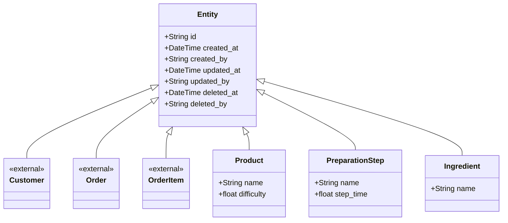

# Entities



## Entity

Shared base for every **entity** in the domain: identity plus audit trail

### Design notes

- `id` defaults to a `uuid4` when not supplied, so entities are identifiable
  before they ever reach a service or store.

## Ingredient

A raw material consumed while preparing a product. An ingredient knows *what it
is

## Product

What the customer buys — the menu item. A product knows how hard it is to make
and which steps produce it; it does not know anything about stock.

### Design notes

`difficulty` exists to feed the preparation-time formula of requirement 10:

```
step_duration = step.step_time / chef.experience * product.difficulty
```

It is stored here, on the product, because difficulty is a property of the dish
itself and is set by the company — not by the customer and not by the chef.

**Product is not Ingredient.** A product is *sold*; an ingredient is *consumed*.
Nothing stocks a product and nothing orders an ingredient. They look similar
because both carry `id` and `name`, but merging them would leave `difficulty`
and `PreparationStep[]` meaningless on a tomato, and `quantity_in_stock`
meaningless on a hamburger.

## PreparationStep

One step in the recipe for a product ("toast the bread"), with the time it takes
at baseline. Steps are what make requirement 9d real: the simulator must
actually wait for each one.
