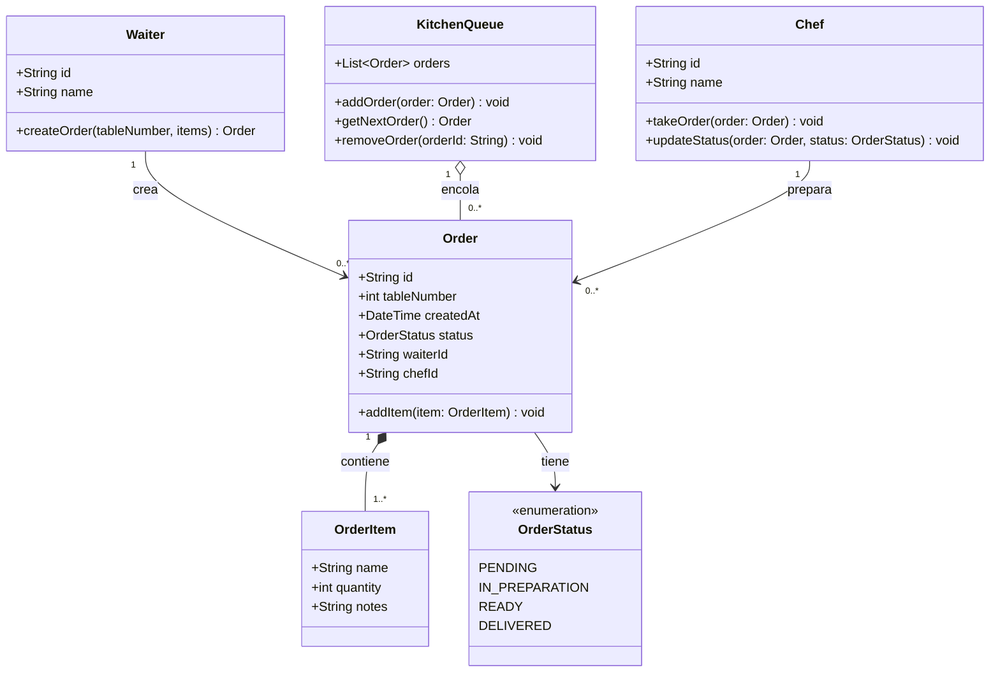

```mermaid
classDiagram
    class Waiter {
        +String id
        +String name
        +createOrder(tableNumber, items) Order
    }

    class Chef {
        +String id
        +String name
        +takeOrder(order: Order) void
        +updateStatus(order: Order, status: OrderStatus) void
    }

    class Order {
        +String id
        +int tableNumber
        +DateTime createdAt
        +OrderStatus status
        +String waiterId
        +String chefId
        +addItem(item: OrderItem) void
    }

    class OrderItem {
        +String name
        +int quantity
        +String notes
    }

    class KitchenQueue {
        +List~Order~ orders
        +addOrder(order: Order) void
        +getNextOrder() Order
        +removeOrder(orderId: String) void
    }

    class OrderStatus {
        <<enumeration>>
        PENDING
        IN_PREPARATION
        READY
        DELIVERED
    }

    Waiter "1" --> "0..*" Order : crea
    Order "1" *-- "1..*" OrderItem : contiene
    KitchenQueue "1" o-- "0..*" Order : encola
    Chef "1" --> "0..*" Order : prepara
    Order --> OrderStatus : tiene
```