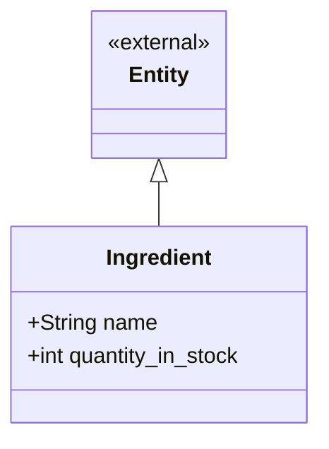

# Ingredient context

A raw material consumed while preparing a product. An ingredient knows *what it
is*; how much of it exists is a stock concern.

```mermaid
classDiagram
    class Ingredient {
        +String name
        +int quantity_in_stock
    }

    class Entity {
        <<external>>
    }

    Entity <|-- Ingredient
```
