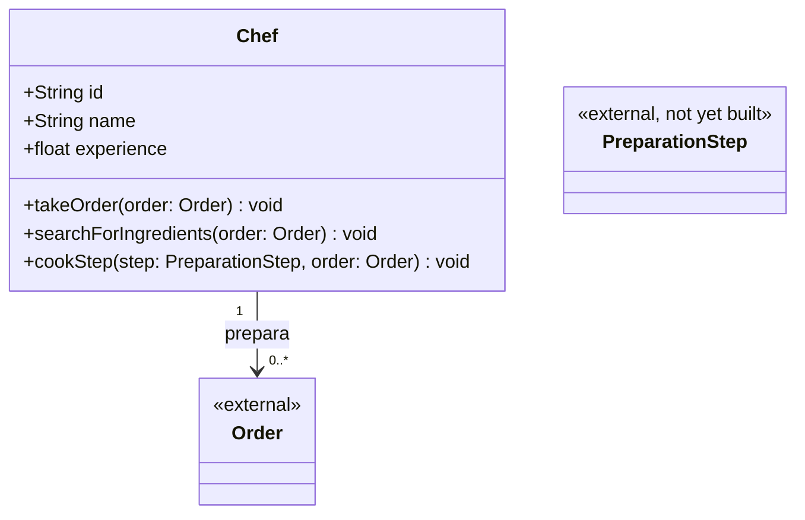

# Chef context

```mermaid
classDiagram
    class Chef {
        +String id
        +String name
        +float experience
        +takeOrder(order: Order) void
        +searchForIngredients(order: Order) void
        +cookStep(step: PreparationStep, order: Order) void
    }

    class Order {
        <<external>>
    }

    class PreparationStep {
        <<external, not yet built>>
    }

    Chef "1" --> "0..*" Order : prepara
```
