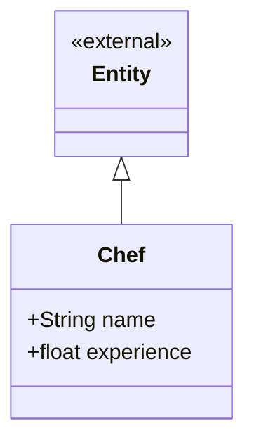

# Chef context

Who prepares the orders. A chef knows how skilled they are; the work of moving
an order through its states belongs to the order.



## Design notes

`experience` is the chef's speed factor in the preparation-time formula of
requirement 10:

```
step_duration = step.step_time / chef.experience * product.difficulty
```

It divides, so a higher number means a faster chef. This is the only reason the
chef participates in the simulation's timing at all — which is why it belongs on
the entity rather than being looked up elsewhere.

**`take_order` and `search_for_ingredients` are not here.** They used to be, but
they read only `self.id` and wrote everything to the order — Feature Envy. Both
are status transitions, so they moved onto `Order`, the object whose state
actually changes. See `../order/diagram.md`.

A chef is associated with the orders they prepare, but that link is navigated
from `Order.chef`, so it is drawn in the order context rather than duplicated
here.

## Pending decisions

- **`experience` is missing from the code.** `chef.py` currently defines only
  `name`. The formula in requirement 10 cannot be implemented until the field
  exists.
- **Range and meaning of `experience` are undefined.** Requirement 10 leaves the
  scale to you ("un numero que le pueden poner al chef ustedes mismos"). Decide
  the baseline — `1.0` meaning "cooks exactly at the step's stated time" is the
  reading that makes `step_time` self-explanatory — and whether values below
  that (a slower chef) are allowed. Guard against zero either way, since it
  divides.
- **Assigning a chef to an order** needs the queue and chef availability, so it
  is service work, not a method here.
