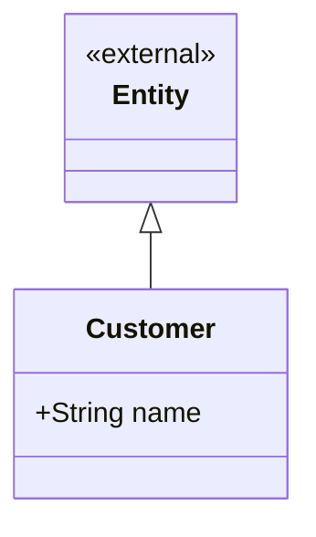

# Customer context

The person who places orders. A customer knows *who they are*, not how the
kitchen works.

```mermaid
classDiagram
    class Customer {
        +String name
    }

    class Entity {
        <<external>>
    }

    Entity <|-- Customer
```
