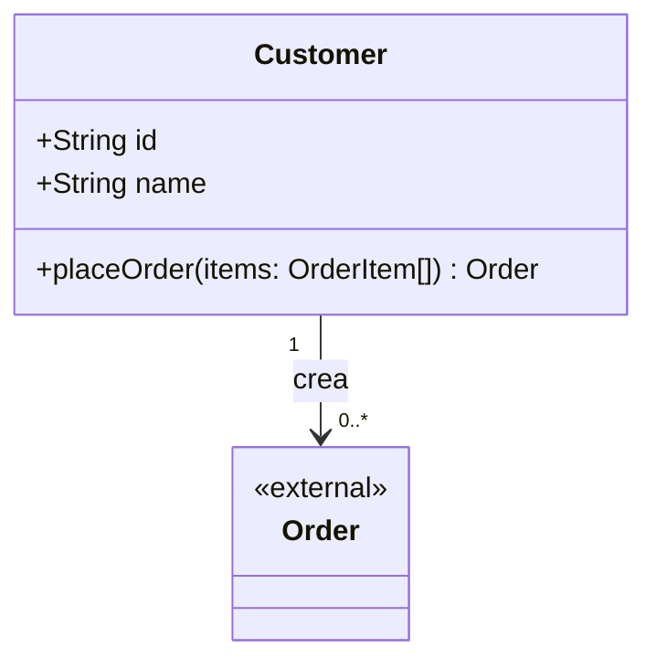

# Customer context

```mermaid
classDiagram
    class Customer {
        +String id
        +String name
        +placeOrder(items: OrderItem[]) Order
    }

    class Order {
        <<external>>
    }

    Customer "1" --> "0..*" Order : crea
```
