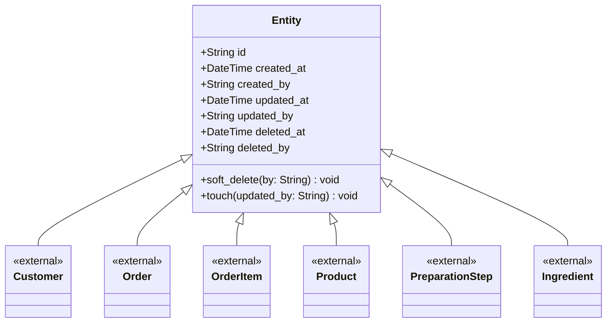

# Entity (base) context

Shared base for every **entity** in the domain: identity plus audit trail
(who created / updated / soft-deleted it, and when).

## Design notes

- `id` defaults to a `uuid4` when not supplied, so entities are identifiable
  before they ever reach a service or store.
- `touch()` is called by every mutator on every subclass, which is what keeps
  `updated_at` / `updated_by` honest without each subclass re-implementing it.
- `soft_delete()` never removes data — it marks it.
