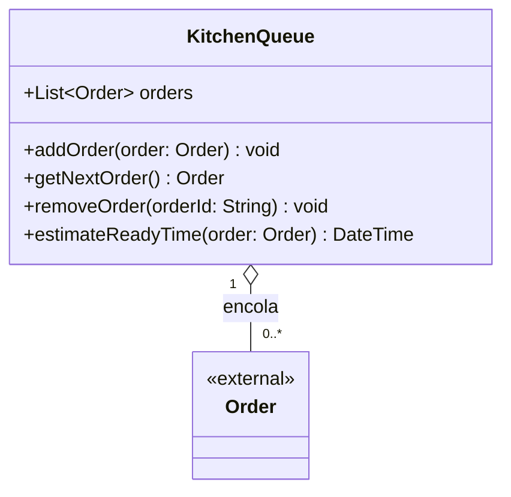

# Kitchen queue context

```mermaid
classDiagram
    class KitchenQueue {
        +List~Order~ orders
        +addOrder(order: Order) void
        +getNextOrder() Order
        +removeOrder(orderId: String) void
        +estimateReadyTime(order: Order) DateTime
    }

    class Order {
        <<external>>
    }

    KitchenQueue "1" o-- "0..*" Order : encola
```
