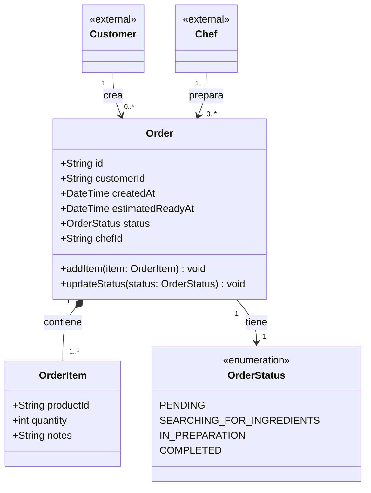

# Order context

```mermaid
classDiagram
    class Order {
        +String id
        +String customerId
        +DateTime createdAt
        +DateTime estimatedReadyAt
        +OrderStatus status
        +String chefId
        +addItem(item: OrderItem) void
        +updateStatus(status: OrderStatus) void
    }

    class OrderItem {
        +String productId
        +int quantity
        +String notes
    }

    class OrderStatus {
        <<enumeration>>
        PENDING
        SEARCHING_FOR_INGREDIENTS
        IN_PREPARATION
        COMPLETED
    }

    class Customer {
        <<external>>
    }

    class Chef {
        <<external>>
    }

    Order "1" *-- "1..*" OrderItem : contiene
    Order "1" --> "1" OrderStatus : tiene
    Customer "1" --> "0..*" Order : crea
    Chef "1" --> "0..*" Order : prepara
```
