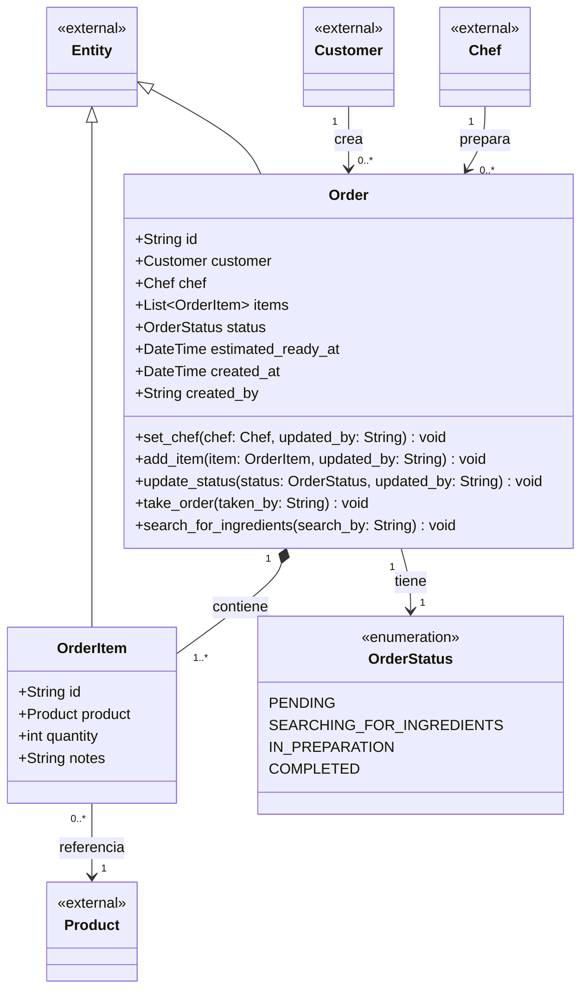

# Order context

What a customer asked for, and how far along it is. `Order` is the entity that
guards its own status and item list.

## Design notes

**Order holds object references, not foreign keys.** `customer` and `chef` are
`Customer` and `Chef` instances rather than `customerId` / `chefId` strings

`*--` to `OrderItem` is composition: an order item has no life of its own once
its order is gone. `-->` to `Customer` is a plain association — customers outlive
orders.