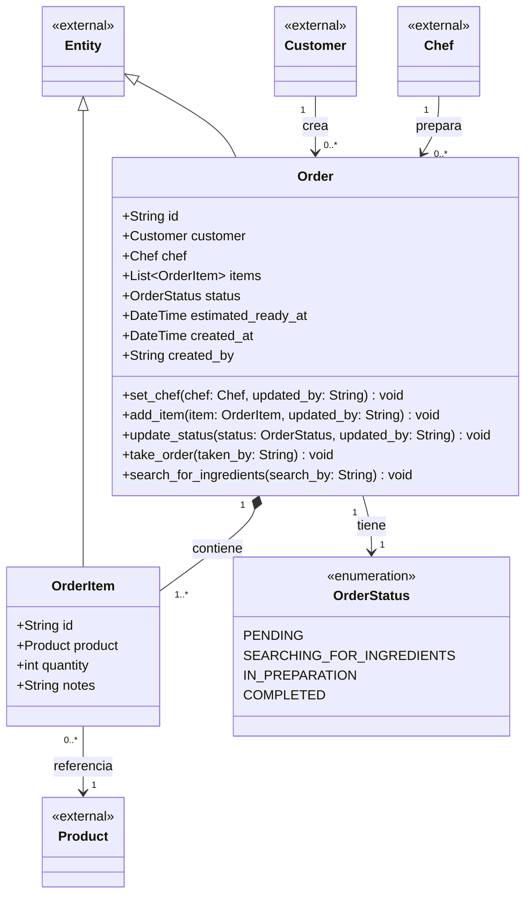

# Order context

What a customer asked for, and how far along it is. `Order` is the entity that
guards its own status and item list.

## Design notes

**Order holds object references, not foreign keys.** `customer` and `chef` are
`Customer` and `Chef` instances rather than `customerId` / `chefId` strings, and
`OrderItem` holds a `Product` rather than a `product_id`. This is an in-memory
simulator, so navigating the graph directly is simpler than resolving IDs
through a lookup — and it lets the time formula reach
`item.product.difficulty` without a service call.

**`take_order` and `search_for_ingredients` live here, not on `Chef`.** As
methods on `Chef` they read only `self.id` and wrote everything to `order` —
classic Feature Envy. Both are status transitions on the order, so they belong
to the object whose state changes. They funnel through `update_status()` rather
than assigning `self.status`, which keeps every transition on one path.

**Every mutator calls `touch()`** so `updated_at` / `updated_by` stay accurate
without callers having to remember.

`*--` to `OrderItem` is composition: an order item has no life of its own once
its order is gone. `-->` to `Customer` is a plain association — customers outlive
orders.

## Pending decisions

- **No history yet.** Requirement 11 calls for tracking status changes, and the
  system diagram carries `OrderHistory` and `HistoryEntry`. Neither exists in
  code. `update_status()` is the natural place to append an entry, since it needs
  nothing external — which is a strong argument for the behaviour staying on the
  entity rather than moving to a service.
- **Illegal transitions are currently allowed.** `update_status()` accepts any
  value, so `PENDING → COMPLETED` skipping preparation would succeed. Decide
  whether the entity rejects invalid transitions or merely records them.
- **Multiplicity mismatch.** The diagram says `1..*` items, but the constructor
  defaults to an empty list, so an order can exist with none. Either the
  constructor should require at least one item or the diagram should read `0..*`.
- **Ready-time estimate.** `estimated_ready_at` is declared but never set.
  Requirement 9b wants it computed at placement time from the queue — service
  work, since it needs to see other orders.