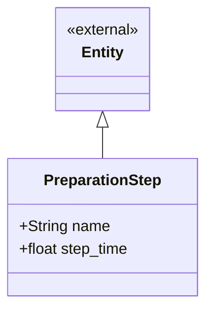

# PreparationStep context

One step in the recipe for a product ("toast the bread"), with the time it takes
at baseline. Steps are what make requirement 9d real: the simulator must
actually wait for each one.

