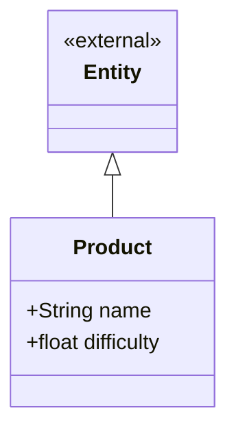

# Product context

What the customer buys — the menu item. A product knows how hard it is to make
and which steps produce it; it does not know anything about stock.



## Design notes

`difficulty` exists to feed the preparation-time formula of requirement 10:

```
step_duration = step.step_time / chef.experience * product.difficulty
```

It is stored here, on the product, because difficulty is a property of the dish
itself and is set by the company — not by the customer and not by the chef.

**Product is not Ingredient.** A product is *sold*; an ingredient is *consumed*.
Nothing stocks a product and nothing orders an ingredient. They look similar
because both carry `id` and `name`, but merging them would leave `difficulty`
and `PreparationStep[]` meaningless on a tomato, and `quantity_in_stock`
meaningless on a hamburger.

Requirement 9c blurs this — it says *"productos en existencia"* and then names
the resulting status *"En busca de ingredientes"*. The model follows the second
reading: only ingredients are stocked.

Composition (`*--`) is used for the step relationship because a `PreparationStep`
has no meaning outside the product that defines it.

## Pending decisions

- **Items sold ready-made** (a bottled drink, a bag of chips) are both sellable
  and stocked. Current plan: model them as a `Product` with a single ~0-time
  `PreparationStep` that consumes one same-named `Ingredient`, so that
  `PreparationStep.execute` stays the only path by which anything is produced.
- Requirement 10 says *"la dificultad del pedido (de la orden del cliente)"*.
  Difficulty currently lives on `Product`. Confirm whether an order containing
  several products derives its difficulty from them (max? sum? per-item?) or
  whether `Order` carries its own.
